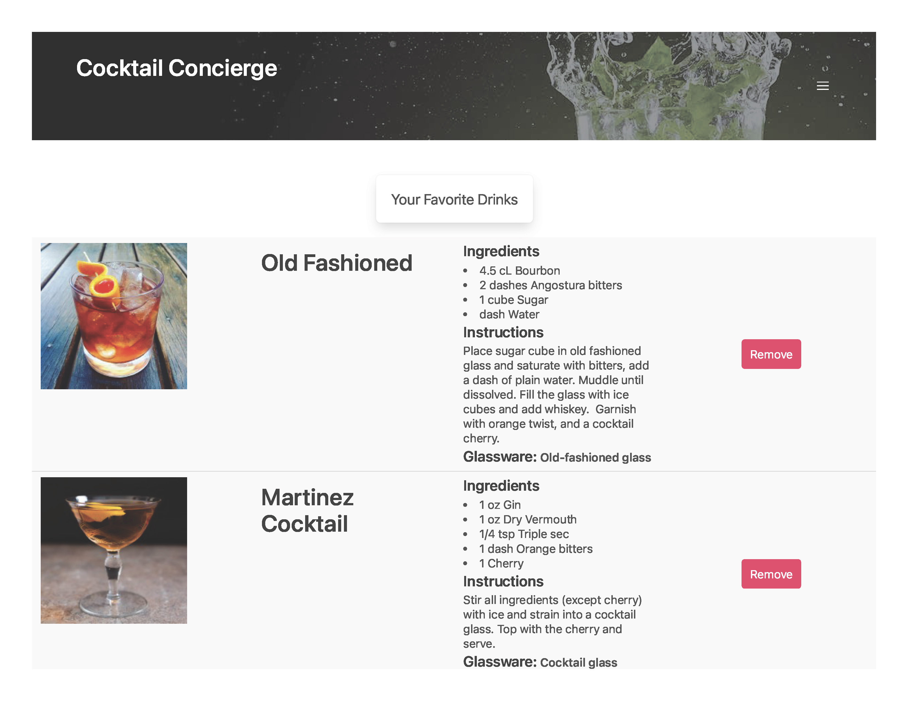

#  Cocktail Concierge 
A website to connect the user to a cocktail that will wet their whistle, every time. Created by Matthew Bronstein, Tyler Esselman, and Joseph Ruiz.

## Description
This is the first group project in the Northwestern Coding Bootcamp (Modules 1-6). <em><strong>Cocktail Concierge</strong></em> is a cocktail search web application where a user can input a cocktail name or simply search through a list of provided ingredients and receive a list of cocktails corresponding to the search query. Each cocktail is presented in a table with the cocktail image and name, ingredients, instructions, and optimal glassware.

In addition, the user may save any cocktail that catches their eye, which can be viewed at any time on the "Favorites" page. Not a fan of a cocktail you saved? Simply remove it and move on to your other favorites!

Feeling lucky? Within the "Random" page, ask the bartender and you will be presented with a random cocktail. This cocktail not your cup of tea? Ask the bartender again, and they will keep recommending drinks. If you find one you like, save it to your favorites!

## Requirements
Our group was expected to use the information we learned over the past month to create a real-world front-end application that we'll be able to showcase to potential employers. In addition to coding the project, we were also expected to follow industry standards for control flow through git to minimize the amount of merge conflicts, since this was our first time working in a group environment.

The project had to fulfill the following requirements:

* Use a CSS framework other than Bootstrap.

* Be deployed to GitHub Pages.

* Be interactive (i.e., accept and respond to user input).

* Use at least two server-side APIs.

* Does not use alerts, confirms, or prompts (use modals).

* Use client-side storage to store persistent data.

* Be responsive.

* Have a polished UI.

* Have a clean repository that meets quality coding standards (file structure, naming conventions, follows best practices for class/id naming conventions, indentation, quality comments, etc.).

* Have a quality README (with unique name, description, technologies used, screenshot, and link to deployed application).

## Technologies Used
HTML5, CSS, JavaScript, jQuery, Bulma CSS Framework, and [The Cocktail DB](https://www.thecocktaildb.com/api.php) API.

## Link to live page
[Live Link](https://tyleresselman.github.io/cocktail-concierge-project-1/index.html)

## Screenshots

## Licensing
Please view the attached [MIT Licensing Agreement](./LICENSE)